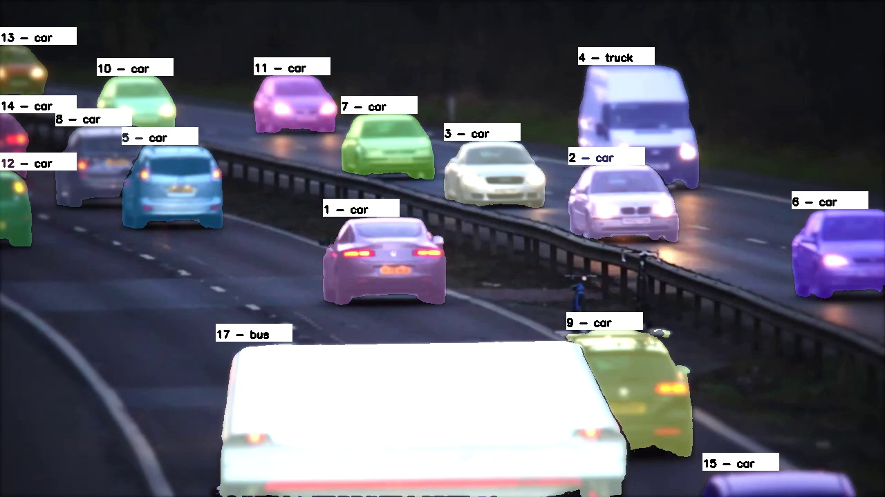

# Car-Segmentation-In-Video-Using-SAM2

In this repository SAM2 is used to segment cars in a traffic road video. 



The project uses the following components:
- Cars are detected using [YOLOv8](https://docs.ultralytics.com/models/yolov8/) small.
- The bounding boxes are passed to [SAM2](https://github.com/facebookresearch/sam2) for segmentation.
- [SORT](https://github.com/abewley/sort) is used to track cars accross frames.


## Environment Setup

Create an Anaconda environment using `python=3.10`. Navigate to the root folder of the project and install requeriments

```bash
pip install -r requeriments.txt
```

Clone the SORT repository

```bash
git clone https://github.com/abewley/sort.git
```

Replace the `sort.py` file in the cloned folder with the updated version provided in this repository under the `SORT FILE UPDATED` folder. This modified file includes a key change required for correct functionality in this application.

## Install PyTORCH

If your machine has a CUDA compatible GPU, install:

```bash
pip install torch==2.7.1 torchvision==0.22.1 torchaudio==2.7.1 --index-url https://download.pytorch.org/whl/cu118
```

Otherwise, install the versions for CPU

```bash
pip install torch==2.7.1 torchvision==0.22.1 torchaudio==2.7.1
```

## Install and Setup SAM2
Clone the SAM2 repository and install it:

```bash
git clone https://github.com/facebookresearch/sam2.git && cd sam2
pip install .
```
Download the following files and place them in a folder named `sam2_model`:
- [Checkpoint](https://dl.fbaipublicfiles.com/segment_anything_2/092824/sam2.1_hiera_small.pt) (sam2.1_hiera_small.pt)
- [Configuration file](https://github.com/facebookresearch/sam2/blob/main/sam2/configs/sam2.1/sam2.1_hiera_s.yaml)


## Video Input and Output

The video used in this project is a royalty-free video available on [YouTube](https://www.youtube.com/watch?v=zOq2XdwHGT0).
A trimmed version named `cars.mp4` is included in the `video` folder of this repository.

After executing the notebook, the processed output video will be saved in the same folder as `cars_processed.mp4`.


